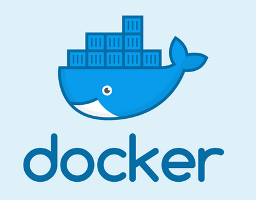

# real time delay departures from S+U Alexanderplatz.

The workflow using Docker Compose:

Implementation of a dockerized data pipeline with the following workflow:
Collect departure information from BVG Berlin & Brandenburg rest API (https://v5.vbb.transport.rest/getting-started.html) using Requests module.
Store the retrieved information in MongoDB.
Build an ETL job to:
- extract the departures from MongoDB 
- transfer the info to Postgres database
- make constant queries to keep the delay information up to date
- post via a bot